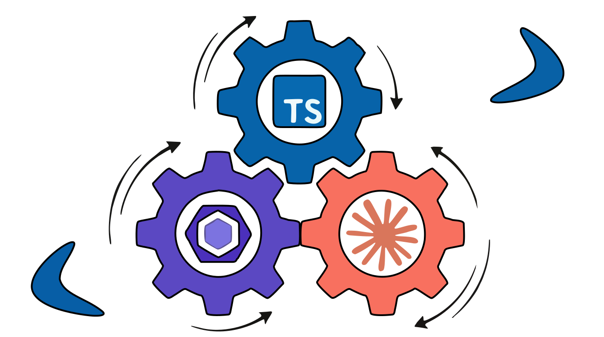

# Typescript Boilerplate ✨

## Introduction

This is a Typescript boilerplate project designed to streamline modern TypeScript practices. It includes robust configurations, reusable decorators, and interfaces to ensure scalability and maintainability. The project is modular, making it easy to integrate into existing workflows or use as a standalone solution.



---

## Table of Contents

- [Introduction](#introduction)
- [Features](#features)
- [Installation](#installation)
- [Folder Structure](#folder-structure)
- [Dependencies](#dependencies)
- [Contributing](#contributing)
- [License](#license)

---

## Features

- **TypeScript Support**: Strongly typed with TypeScript for enhanced development experience.

---

## Installation

1. Clone the repository:

   ```bash
   git clone <repository-url>
   cd typescript-boilerplate
   ```

2. Install dependencies:

   ```bash
   npm install
   ```

---

## Folder Structure

### Root Level

- **`package.json`**: Lists dependencies and scripts.
- **`tsconfig.json`**: TypeScript compiler configuration.

### `src` Folder

The `src` folder is organized into a modular structure with the following subfolders:

1. **`config/`**

- Centralized configuration for the project, such as environment-specific settings.
- Example: `environment.config.ts`.

2. **`decorators/`**

- Reusable decorators.
- Example: `field-step.decorator.ts`, `step.decorator.ts`.

3. **`interfaces/`**

- TypeScript interfaces that define the structure of configurations, settings, and more.
- Example: `environment.interface.ts`, `playwright-config.interface.ts`.

4. **`utils/`**

- Utility functions and helpers for common tasks, such as data manipulation, API calls, etc.

---

## ESLint Configuration

The `.eslint/` directory provides modular, framework-specific ESLint configs. Compose them in your `eslint.config.mjs`.

### Node.js (default)

```js
import nodeConfigs from './.eslint/node.eslint.mjs';
export default [...nodeConfigs];
```

### React

```js
import { createNodeConfig } from './.eslint/node.eslint.mjs';
import { createReactConfig } from './.eslint/react.eslint.mjs';
export default [...createNodeConfig(), ...createReactConfig()];
```

### NestJS

```js
import { createNestConfig } from './.eslint/nest.eslint.mjs';
export default [...createNestConfig()];
```

### Vue (JavaScript SFCs)

Requires `eslint-plugin-vue` installed in your project.

```js
import { createNodeConfig } from './.eslint/node.eslint.mjs';
import { createVueConfig } from './.eslint/vue.eslint.mjs';
export default [...createNodeConfig(), ...createVueConfig()];
```

### Vue (TypeScript SFCs)

Requires `eslint-plugin-vue` installed. Also add `**/*.vue` to your `tsconfig.json` `include` array.

```js
import { createNodeConfig } from './.eslint/node.eslint.mjs';
import { createVueTsConfig } from './.eslint/vue.eslint.mjs';
export default [...createNodeConfig(), ...createVueTsConfig()];
```

Update your root `files` glob to include `.vue`:

```js
{
  files: ['**/*.{js,mjs,cjs,ts,vue}'];
}
```

### Architectural boundaries (opt-in)

Enforce layered import rules per framework:

```js
import nodeBoundaries from './.eslint/boundaries/node.eslint.mjs';
import vueBoundaries from './.eslint/boundaries/vue.eslint.mjs';
// react, nest, vue variants available
```

---

## Dependencies

- **TypeScript**: Type safety and enhanced developer experience.
- **ESLint**: Linter for maintaining code quality.
- **Prettier**: Code formatter for consistent style.

Full list of dependencies is available in `package.json`.

---

## Contributing

1. Fork the repository.
2. Create a new feature branch:
   ```bash
   git checkout -b feature-name
   ```
3. Commit your changes:
   ```bash
   git commit -m "Description of feature"
   ```
4. Push to your branch:
   ```bash
   git push origin feature-name
   ```
5. Open a pull request.

---

## License

This project is licensed under the [MIT License](LICENSE).
